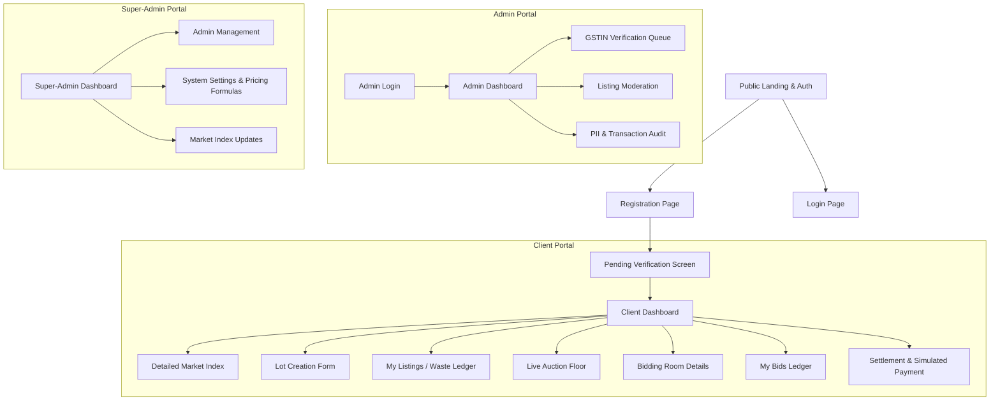

# FibreTrace B2B Marketplace - Website Concept & UI Page Architecture

## 1. The Core Website Idea

**FibreTrace** is a digitized commodity exchange designed to solve the waste monetization problem between Ludhiana garment factories (textile waste producers) and Panipat spinning mills (yarn recyclers). 

Traditionally, factories sell mixed, unsorted scrap to middlemen for very low cash payouts because they don't know the true value or composition of their waste. Recyclers receive highly contaminated material, resulting in a **40% processing yield loss**.

FibreTrace digitizes this transaction:
1. **Sort & Profile:** Factories list sorted waste lots with verified composition (e.g., 80/20 Cotton/Poly) and upload photos.
2. **Discover:** Panipat buyers search for high-purity feedstocks on a real-time marketplace floor.
3. **Bid:** Buyers bid competitively via an auction format. 
4. **Settle:** Once a bid is accepted, secure payments and simulated logistics take place, maintaining absolute privacy of both parties (hiding phone numbers/GSTINs) to protect the marketplace from being bypassed.

---

## 2. Complete Map of UI Pages

Below is the complete architectural layout of all pages required for the MVP, organized by access level.

---

### Phase 1: Public Pages (No Authentication Required)

| Page Name | Description | Key UI Components |
| :--- | :--- | :--- |
| **1. Public Landing Page** | Explains the FibreTrace platform, the Ludhiana-Panipat corridor impact, and features. | Hero section with dynamic graphics, "How it Works" flow, CTA buttons (Register/Login), live baseline scrap pricing ticker. |
| **2. Registration Page** | Sign-up form for new Factories and Recyclers. | Inputs: Company Name, Email, Password, Phone Number, GSTIN. Registration success message with a prompt stating "Verification Pending". |
| **3. Login Page** | Simple, secure gateway. | Email/Password fields, "Forgot Password" link. |

---

### Phase 2: Client Portal (Authenticated Buyers & Sellers)
*This is a single unified dashboard. A verified user can list waste (Seller) or bid on waste (Buyer) without needing separate accounts.*

| Page Name | Description | Key UI Components |
| :--- | :--- | :--- |
| **4. Pending Verification Screen** | A landing page for newly registered users whose GSTIN is still being manually verified by admins. Blocks access to core features. | "Under Review" status badge, estimated review timeline card, support contact link. |
| **5. Client Dashboard (Home)** | The hub for active users. | Real-time market index summary graph, quick action tiles ("List a New Lot", "Browse Marketplace"), user stats (Active Lots, Active Bids, simulated revenue/spend stats). |
| **6. Detailed Market Index** | In-depth historical pricing for waste commodities. | Charting tool (Line graphs of weekly ₹/kg rates for Sorted Cotton, Polyester Blends, Acrylic, etc.). |
| **7. Smart Lot Creation Page (Seller)** | Where factories list their waste under 60 seconds. | Form: Waste Category dropdown, Primary Fiber Percentage sliders, Color Sorting binary toggle, Weight input field (min 100 kg), Multi-file Image Uploader (min 2 photos required), Auto-suggested price calculation display. |
| **8. My Listings / Digital Waste Ledger (Seller)** | Personal ledger tracking all listed waste lots. | Tabs: Active Lots (showing live highest bids), Completed Lots (with options to download simulated EPR disposal compliance certificates), Cancelled Lots. |
| **9. Lot Details & Bid Acceptance Page (Seller)** | Individual page for the seller to manage an active auction. | Photo carousel, listing specifications, active bid list, "Accept Bid" primary CTA. |
| **10. Live Auction Floor (Buyer)** | The marketplace feed where buyers search for feedstock. | Filters (category, fiber composition slider, estimated weight, location region), search bar, card-based listing previews (showing general location, composition, and current highest bid with company details masked). |
| **11. Listing Bidding Room (Buyer)** | Individual lot details and active bidding room for buyers. | Real-time current highest bid display (via WebSockets), bid input form (₹/kg), photo gallery, technical lot specifications, anonymized historical bid list. |
| **12. My Active Bids Ledger (Buyer)** | Personal tracking sheet for active bids. | Grid showing bid lot number, bid amount, status indicator (Winning, Outbid, Awaiting Settlement). |
| **13. Trade Settlement & Payment Screen** | Triggered after a bid is accepted. | Simulated invoice, "Pay Commission" button (simulated placeholder gateway modal), simulated logistics status timeline tracker (e.g., "Ready for Pickup" -> "In Transit" -> "Delivered"). Absolute privacy: buyer and seller PII (phone/address/GSTIN) is masked from each other. |

---

### Phase 3: Admin Portal (Moderators & Verification Staff)

| Page Name | Description | Key UI Components |
| :--- | :--- | :--- |
| **14. Admin Dashboard** | Platform status center. | KPI cards (Total active lots, verification queue count, overall transaction volume), pending action alerts. |
| **15. GSTIN Verification Queue** | Queue of pending registrations needing validation. | List of pending users, full registration details display (GSTIN, Company name), action buttons (Approve / Reject with rejection reason input). |
| **16. Listing Moderation Center** | Review board for active lots. | Audit list of lots, action controls to flag, edit, or delete listings violating terms (e.g., inappropriate images). |
| **17. PII & Transaction Audit Ledger** | Secure dashboard for handling disputes or reviews. | Complete unmasked transaction history showing the actual names, phone numbers, and GSTINs of both parties involved in matched bids. |

---

### Phase 4: Super-Admin Portal (System Owners)

| Page Name | Description | Key UI Components |
| :--- | :--- | :--- |
| **18. Super-Admin Dashboard** | High-level platform health and monetization tracker. | Cumulative system revenue graphs (simulated commission earnings), active admin lists, active user counts. |
| **19. Admin Account Management** | Portal configuration. | Register new Admin accounts, update roles, or revoke access controls. |
| **20. Live Market Index Manager** | Weekly update tool for pricing. | Matrix editor to update the weekly baseline pricing values displayed in the public and client indexes. |
| **21. Platform System Settings** | Core constant managers. | Config inputs: suggested base price algorithm coefficients, simulated commission rate (currently ₹1.50/kg), system-wide limits. |
